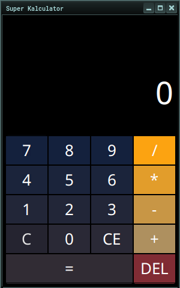
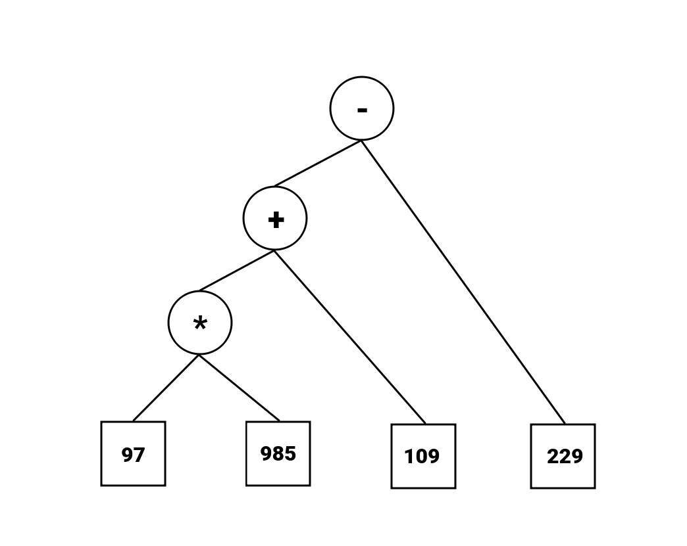

# Super Kalculator

## Spécifications non fonctionnelles
Dans une expression, nous avons des opérations et des termes. Les différentes opérations possibles
que nous pouvons avoir sont des additions, multiplications, soustrations et divisions. Les termes
ne sont uniquement que des nombres entiers. Donc, il n'y aura aucune implémentation pour gérer
des nombres réels. Vooici un exemple d'expression :

$$
97 \times 985 + 109 - 229
$$

L'expression à calculer sera représentée sous forme arborescence, dans un premier temps. C'est ce
arbre de calcul qui sera évalué pour obtenir le résultat final. Danc, dans ce arbre de calcul,
les branches représentent les termes et les noeuds représentent les opérations.

## Spécifications fonctionnelles
