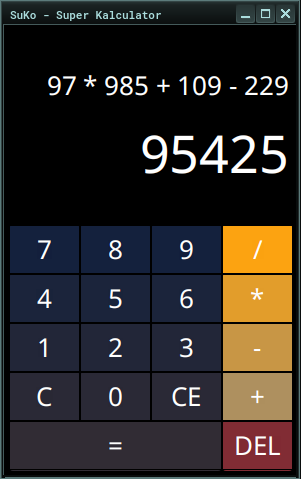
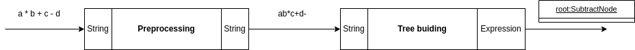
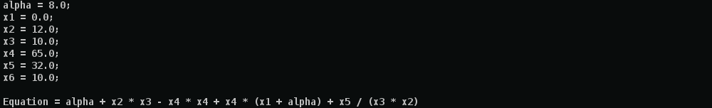

# SuKo


Une calculatrice simple avec interface graphique développée en **JavaFX** et **FXML + CSS**.
Comme spécifié ci-dessous, elle ne gère pas les nombres à virgule, ni les parenthèses ni
autres fonctions mathématiques complexes à part l'addition, la soustration, la multiplication
et la division.

Vous pouvez utiliser les boutons présents sur l'interface utilisateur
ou utiliser le pavé numérique de votre clavier pour interagir avec le logiciel.

<br/>
<br/>

<div align="center">



</div>

- Appuyez sur `[ENTER]` de votre clavier ou *=* de la calculatrice pour avoir le résultat;
- Appuyez sur `[C]` de votre clavier ou le bouton **C** de la calculatrice
pour reinitialiser la calculatrice;
- Appuyez sur `[DELETE]` de votre clavier ou le bouton **CE** de la calculatrice pour effacer
le champs de saisi inférieur.
- Appuyez sur `[BACK SPACE]` de votre clavier ou le bouton **DEL** de la calculatrice pour
effacer chiffre par chiffre le nombre saisi sur la champs de saisi inférieur.
- Vous avez la possibilité de changer l'opérateur précédement saisi en appuyant sur une des
touche des opérateurs ( + - * /), ceci même si vous aviez déjà saisi un nombre dans champs
de saisi inférieur.


## Spécifications
Développez une calculatrice dotée d’une interface qui reçoit les informations entrées par l’utilisateur. Ces informations permettront de calculer le résultat des opérations.

- **Etape 0** : La calculatrice attend la saisie du premier terme.
- **Etape 1** : D’abord le premier terme est entré par la fourniture successive du (ou des) chiffre(s) le composant.
- **Etape 2** : Ensuite, un symbole est fourni par l’entrée d’un des signes des opérations acceptés par la calculatrice (+ -  DIV *).
- **Etape 3** : Et enfin le deuxième terme qui sera composé de 1 ou plusieurs chiffres aussi sera entré.
- **Etape 4** : Apres cette étape, l’utilisateur devra taper le signe = et le résultat définitif de l’opération lui sera affiché et la calculatrice reviendra à l’**étape 1**.
A l’entrée de « C », l’opération est remise à zéro, et on revient à l’**étape 0**.

> **NOTE** : l’application pourra ne gérer que les nombres entiers dans un premier temps. Ensuite, elle ne devra gérer que les cas normaux de fonctionnement. Ainsi, les cas exceptionnels d’erreur (cas anormaux) ne seront pas pris en compte (Exemple : appui sur = après saisie de la première opérande)

## Conception
Dans une expression, nous avons des opérations et des termes. Les différentes opérations possibles
que nous pouvons avoir sont des additions, multiplications, soustrations et divisions. Les termes
ne sont uniquement que des nombres entiers. Donc, il n'y aura aucune implémentation pour gérer
des nombres réels. Vooici un exemple d'expression :

$$
97 \times 985 + 109 - 229
$$

### Interpreteur
L'expression à calculer sera représentée sous forme arborescente, dans un premier temps. C'est ce
arbre de calcul qui sera évalué pour obtenir le résultat final. Dans l'exemple
suivant, les noeuds en forme de carré représentent les termes et les noeuds en forme circulaire
représentent les opérations ($+, -, \times \div$).

<div align="center">
	
<p>

*Figure 01* : Exemple d'un arbre de calcul.

</p>
<br/>

</div>

- Les noeuds en forme de carré représentent les noeuds terminaux.
- Les noeuds en forme circulaire représentent les noeuds non-terminaux.

Pour parvenir à obtenir ce modèle d'arbre, nous allons utiliser le design pattern **interpreter**.
Voici donc le diagramme des classes modélisant cet arbre :

<div align="center">
	
<p>

*Figure 02* : Diagramme des classes du modèle interpreter.

</p>
<br/>

</div>

- Les noeuds terminaux seront représentés par les instances de la classe `TerminalNode`;
- Les noeuds non-terminaux sont représentés par les instances de la classe `NonTerminalNode`;
- Le contexte `Context` encapsule la liste des variables de l'équation mappées leurs valeurs
respectives;

Le modèle interpreter permet de définir une équation en fonction des variables qu'on peut
renseigner avec leurs valeurs respectives. Ces variables sont représentées par des noeuds
terminaux.

Par contre, ce modèle ne permet pas d'implémenter l'analyseur qui permettra de construire
l'arbre de calcul. Ce qui fera l'objet de la sous-section suivante.


### Analyseur
Dans cette étape de conception, nous allons mettre en place l'analyseur qui va nous permettre
de construire l'arbre du modèle interpreter à partir de l'équation reçue sous forme chaine de
caractères.

L'équation reçue étant sous forme de chaine de caractères, on aura besoin de faire une chaine
de traitement à effectuer sur ce dernier celle-ci afin d'obtenir l'arbre de calcul résultant.
C'est cette chaine de traitement qui constitue l'analyseur. Voici la chaine de traitement
proposée :

<div align="center">
	
<p>

*Figure 03* : Pipeline de l'analyse et construction de l'arbre de calcul.

</p>
<br/>

</div>

Il y a juste deux étapes de traitement.

Pour élaborer cette chaine de traitement, nous allons utiliser le design pattern **Pipeline**.
Ce modèle de conception permet de définir une chaine de responsabilité (processus)
destinée à s'exécuter de façon séquentielle : l'une après l'autre. Voici donc le diagramme
des classes modélisant cette chaine de traitement :


<div align="center">
	
<p>

*Figure 04* : Diagramme des classes de l'analyseur.

</p>
<br/>

</div>

Après l'implémentation, on pourra écrire le code suivant pour initialiser l'analyseur.

```java
Pipeline<String, Expression> analyser = null;
analyser = new Pipeline<>(new Preprocess(...)).addHandler(new TreeBuilder(...));

```

Et pour une expression bien définit sous forme chaine de caractères, on pourra faire comme suit :

```java
Expression treeRoot = analyser.execute("a * b + c - d");

```

`treeRoot` sera donc le noeud racine de l'arbre de calcul résultant de l'expression `a * b + c - d`
.

### Instance de calculatrice
Ici, il s'agira de "builder" une instance de la calculatrice (`Calculator`) muni de son analyseur.
Pour cela nous allons utiliser le pattern **Builder** pour élaboler le programme qui va nous
permettre de construire une instance de notre calculatrice. Voici le diagramme des classes
de l'analyseur :


<div align="center">
	
<p>

*Figure 04* : Diagramme des classes du buildeur d'un objet `Calculator`.

</p>
<br/>

</div>


## Implémentation
Je ne vais pas détailler l'implémentation de toutes les classes énoncées dans la partie,
mais je peux vous montrer le résultat d'implémentation sur un exemple d'équation. Je ferai
la démonstraction sur exemple suivant :

$$
\alpha + x_2 \times x_3 - x_4 \times x_4 + x_4 \times (x_1 + \alpha) + \frac{x_5}{x_3 \times x_2}
$$

### Construction d'une calculatrice
Dans une première étape, on doit construire une instance de la calculatrice `Calculator`.

```java
Builder<Calculator> b = new CalculatorBuilder();
Director director = new Director(b);
director.makeBuild();
Calculator calc = b.getResult();
```

### Définition du contexte
On définit une instance d'un context qui encapsulera toutes les variables de l'équation
associées à leur valeur.

```java
// instantiate the context
Context ctx = new Context();

ctx.assign("alpha", 8);
ctx.assign("x1", 0);
ctx.assign("x2", 12);
ctx.assign("x3", 10);
ctx.assign("x4", 65);
ctx.assign("x5", 32);
ctx.assign("x6", 10);

```

### Équation à évaluer
On définit ensuite l'équation en fonction de ces variables définies précédement.

```java
calc.setEquation("alpha + x2 * x3 - x4 * x4 + x4 * (x1 + alpha) + x5 / (x3 * x2)");
calc.setContext(ctx);

System.out.println(ctx);
System.out.println("Equation = " + calc.getEquation());
```




### Evaluation de l'équation
Maintenant, on peut évaluer l'équation en appelant la fonction `evaluate()` de l'objet `calc`.

```java

try {
	Double result = calc.evaluate();
	// On convertie le resultat en entier avant de l'afficher.
	System.out.println("Result = " + result.intValue());
} catch (SemanticError e) {
	System.out.println("SemanticError: \t" + e);
} catch (Exception e) {
	e.printStackTrace();
}

```


