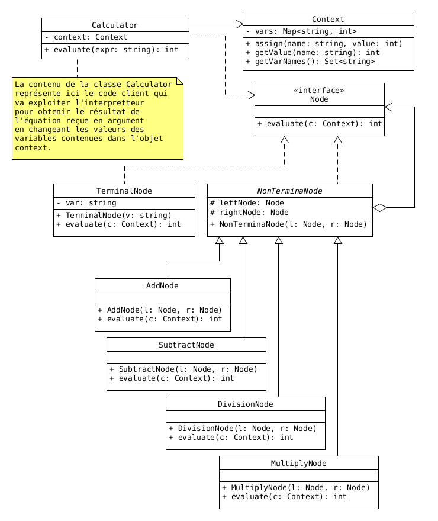

# Super Kalculator

<div align="center">


</div>

## Spécifications
Développez une calculatrice dotée d’une interface qui reçoit les informations entrées par l’utilisateur. Ces informations permettront de calculer le résultat des opérations.

- **Etape 0** : La calculatrice attend la saisie du premier terme.
- **Etape 1** : D’abord le premier terme est entré par la fourniture successive du (ou des) chiffre(s) le composant.
- **Etape 2** : Ensuite, un symbole est fourni par l’entrée d’un des signes des opérations acceptés par la calculatrice (+ -  DIV *).
- **Etape 3** : Et enfin le deuxième terme qui sera composé de 1 ou plusieurs chiffres aussi sera entré.
- **Etape 4** : Apres cette étape, l’utilisateur devra taper le signe = et le résultat définitif de l’opération lui sera affiché et la calculatrice reviendra à l’**étape 1**.
A l’entrée de « C », l’opération est remise à zéro, et on revient à l’**étape 0**.

> **NOTE** : l’application pourra ne gérer que les nombres entiers dans un premier temps. Ensuite, elle ne devra gérer que les cas normaux de fonctionnement. Ainsi, les cas exceptionnels d’erreur (cas anormaux) ne seront pas pris en compte (Exemple : appui sur = après saisie de la première opérande)

## Conception
Dans une expression, nous avons des opérations et des termes. Les différentes opérations possibles
que nous pouvons avoir sont des additions, multiplications, soustrations et divisions. Les termes
ne sont uniquement que des nombres entiers. Donc, il n'y aura aucune implémentation pour gérer
des nombres réels. Vooici un exemple d'expression :

$$
97 \times 985 + 109 - 229
$$

### Interpreteur
L'expression à calculer sera représentée sous forme arborescente, dans un premier temps. C'est ce
arbre de calcul qui sera évalué pour obtenir le résultat final. Dans l'exemple
suivant, les noeuds en forme de carré représentent les termes et les noeuds en forme circulaire
représentent les opérations.

<div align="center">
	
<p>

*Figure 01* : Exemple d'un arbre de calcul.

</p>
<br/>

</div>

- Les noeuds en forme de carré représentent les noeud terminaux.
- Les noeuds en forme circulaire représentent les noeud non-terminaux.

<div align="center">
	
<p>

*Figure 02* : Diagramme des classes du modèle interpreteur.

</p>
<br/>

</div>


### Analyseur

<div align="center">
	
<p>

*Figure 03* : Pipeline de l'analyse et construction de l'abre de calcul.

</p>
<br/>

</div>


<div align="center">
	
<p>

*Figure 04* : Diagramme des classes de l'analyseur.

</p>
<br/>

</div>


```java
Pipeline<String, Expression> analyser = null;
analyser = new Pipeline<>(new Preprocess(...)).addHandler(new TreeBuilder(...));

```

Et pour une expression bien définit sous forme chaine de caractères, on pourra faire comme suit :

```java
Expression treeRoot = analyser.execute("a * b + c - d");
```

`treeRoot` sera donc le noeud racine de l'arbre de calcul généré pour cet expression.

### Instance de calculatrice
Ici, il s'agira de "builder" une instance de la calculatrice (`Calculator`) muni de son analyseur.
Pour cela nous allons utiliser le pattern Builder pour élaboler le programme qui va nous permettre
de construire une instance de notre calculatrice.


## Implémentation

### Construction d'une calculatrice

```java
Builder<Calculator> b = new CalculatorBuilder();
Director director = new Director(b);
director.makeBuild();
Calculator calc = b.getResult();
```

### Définition du contexte

```java
// instantiate the context
Context ctx = new Context();

ctx.assign("alpha", 8);
ctx.assign("x1", 0);
ctx.assign("x2", 12);
ctx.assign("x3", 10);
ctx.assign("x4", 65);
ctx.assign("x5", 32);
ctx.assign("x6", 10);

```

### Expression à évaluer

```java
calc.setExpression("alpha + x2 * x3 - x4 * x4 + x4 * (x1 + alpha) + x5 / (x3 * x2)");
calc.setContext(ctx);

System.out.println(ctx);
System.out.println("Expression = " + calc.getExpression());
```


### Evaluation de l'expression

```java

try {
	Double result = calc.evaluate();
	System.out.println("Result = " + result.intValue());
} catch (SemanticError e) {
	System.out.println("SemanticError: \t" + e);
} catch (Exception e) {
	e.printStackTrace();
}

```


